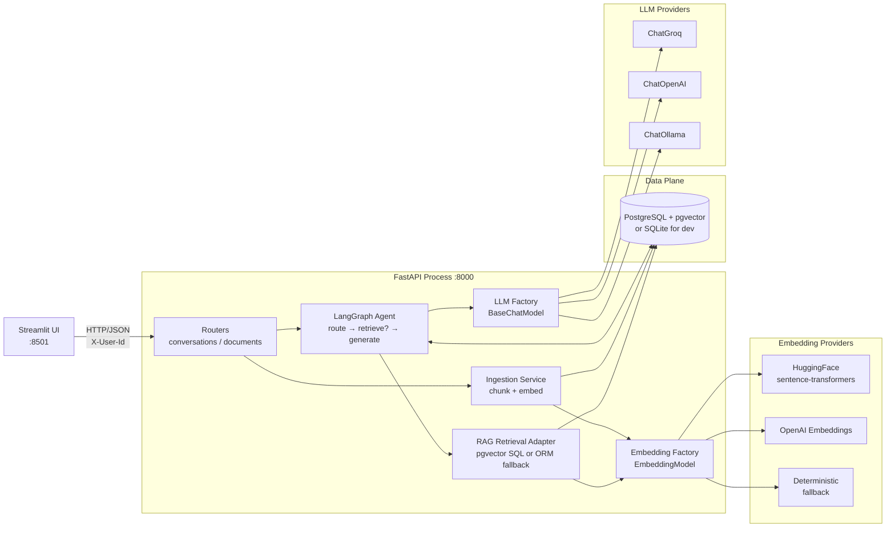
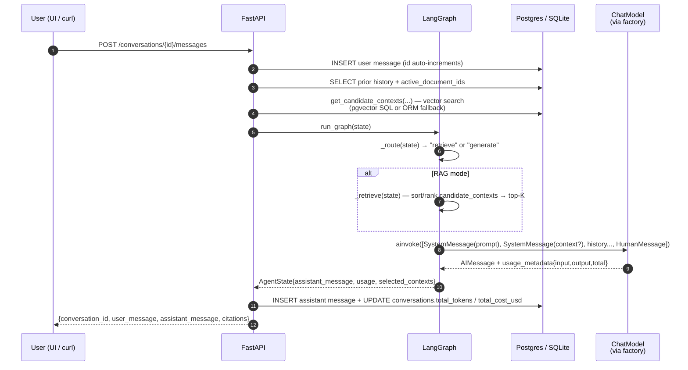

# BOT GPT — System Design (As Built)

**Stack:** FastAPI · LangGraph · LangChain Chat-Model factory · SQLAlchemy 2.x · PostgreSQL + pgvector (SQLite for dev) · Streamlit · Docker Compose

> This document describes the **system as it is currently implemented** in this repository.

---

## 1. Executive Summary

BOT GPT is a stateful, multi-turn conversational backend with two modes from a single API surface:

1. **Open Chat** — direct LLM dialogue with the conversation's prior history.
2. **Grounded Chat (RAG)** — same dialogue path, but the agent retrieves relevant chunks from the user's previously-ingested documents and injects them as context.

The conversational core is a small **LangGraph** state machine (`route → retrieve? → generate`) running in-process inside a **FastAPI** application. LLM provider integration is a **factory** returning a LangChain `BaseChatModel` (`ChatGroq`, `ChatOpenAI`, `ChatOllama`) selected per request. Embedding provider is a parallel factory (`HuggingFaceEmbeddings`, `OpenAIEmbeddings`, deterministic local fallback). Persistence is a single SQLAlchemy schema running on **PostgreSQL+pgvector** in production and **SQLite** for fast local development; the same code path serves both. A **Streamlit** UI provides the demo surface — chat, history, KB upload, and a per-conversation cost dashboard.

The design optimises for the three things the case study explicitly weighs: **clean separation of concerns**, **cost-aware context handling**, and a **credible scale story**.

---

## 2. Goals & Non-Goals

| In scope (built)                                                              | Deliberately out of scope                              |
| ----------------------------------------------------------------------------- | ------------------------------------------------------ |
| Open Chat + Grounded RAG modes                                                | JWT auth (uses header `X-User-Id`)                     |
| Conversation CRUD + message append + cascade delete                           | OpenTelemetry / Langfuse central tracing               |
| PDF / TXT / MD / DOCX upload → chunk → embed → persist                        | Async ingestion worker behind a queue                  |
| Per-document scoped retrieval (vector search filtered by `document_id`)       | Streaming responses (SSE/WebSocket)                    |
| Token + cost accounting per message and per conversation (LLM + embeddings)   | Multi-tenant orgs / workspaces                         |
| Multi-provider LLM via factory (`groq` / `openai` / `ollama`)                 | LLM-response caching                                   |
| Multi-provider embeddings via factory (`huggingface` / `openai` / fallback)   | Hierarchical "parent summary → child chunk" retrieval *(schema present, not populated — see §7)* |
| Dockerfile + docker-compose (api, ui, db, ollama, ollama-pull) + GitHub CI    |                                                        |
| Streamlit demo UI with cost dashboard and provider/model picker               |                                                        |

---

## 3. High-Level Architecture



Three logical layers — **API → Service → Data** — collapsed into one container for the prototype. The agent boundary is intentionally clean so the graph could be lifted into a dedicated worker process later (see §9) without touching the API layer.

> **Note:** The original design (`DESIGN.md` §3) included a Redis node for task status and hot-context caching. Redis has been **removed from the active runtime path**; documents are ingested synchronously inside the request, and there is no caching layer. Re-introducing Redis is a roadmap item (§9).

---

## 4. Tech Stack & Rationale

| Layer            | Choice                                                | Rationale                                                                                                                                                                                            |
| ---------------- | ----------------------------------------------------- | ---------------------------------------------------------------------------------------------------------------------------------------------------------------------------------------------------- |
| API              | **FastAPI**                                           | First-class async, Pydantic validation, OpenAPI for free, the de-facto Python LLM-backend stack.                                                                                                     |
| Agent            | **LangGraph**                                         | A graph beats ad-hoc `if/else` chains; gives a single place to express routing (open vs RAG) and the future summarisation/tool nodes.                                                                |
| LLM abstraction  | **Factory → LangChain `BaseChatModel`**               | Native to the LangGraph ecosystem — graph nodes consume `AIMessage` directly, no marshalling. One uniform surface (`ainvoke`, `usage_metadata`, `bind_tools`) across providers, no extra runtime.    |
| Embeddings       | **Parallel factory** (HF / OpenAI / deterministic)    | Lets the demo run **fully offline** (HF or fallback) yet swap to OpenAI with one env-var flip. Embedding cost flows through the same accounting path as LLM cost.                                    |
| RDBMS            | **PostgreSQL** (prod) / **SQLite** (dev)              | ACID, mature ecosystem, strong JSON. One SQLAlchemy model file works for both backends; pgvector kicks in automatically when the dialect is PostgreSQL.                                              |
| Vectors          | **pgvector** (when on Postgres)                       | Co-locates embeddings with relational data — no second datastore to operate. Cosine similarity via the `<=>` operator; index types IVFFlat / HNSW available.                                         |
| UI               | **Streamlit**                                         | Cheapest path to a credible demo with cost dashboard + model picker.                                                                                                                                 |
| Packaging        | **Docker Compose**                                    | Local-prod parity; one command (`docker compose up`) brings the entire stack online — including a one-shot `ollama-pull` sidecar that warms the local model before the API starts.                  |

**Why a factory over an LLM gateway (e.g. LiteLLM)?** A gateway is the right call when several services share one call surface, centralised key vaulting, or aggregated billing. For a single-service app whose every LLM consumer is already a LangGraph node, a factory keeps the abstraction *inside* our type system, removes a runtime dependency, and integrates natively with LangChain's tool-calling / streaming / retry primitives. When the org grows to many services, swapping the factory's body to point at a LiteLLM proxy is a one-file change.

```37:53:d:\RAG_agent\app\llm\factory.py
def get_chat_model(
    provider: Provider,
    model: str,
    *,
    temperature: float = 0.2,
    timeout: int = 30,
) -> BaseChatModel:
    if provider == "groq":
        if not settings.groq_api_key:
            raise ProviderUnavailableError(
                "Groq is selected but GROQ_API_KEY is not configured."
            )
        return ChatGroq(...)
```

The factory is the **only** place that knows about concrete providers; everywhere else depends on `BaseChatModel`.

---

## 5. Data Schema

### 5.1 Entity-relationship diagram

```mermaid
erDiagram
    users ||--o{ conversations : owns
    users ||--o{ documents : uploads
    conversations ||--o{ messages : contains
    conversations ||--o{ conversation_documents : grounded_in
    documents ||--o{ conversation_documents : referenced_by
    documents ||--o{ document_chunks : split_into
    document_chunks ||--o{ document_chunks : parent_summary

    users {
        uuid id PK
        string email
        timestamptz created_at
    }

    conversations {
        uuid id PK
        uuid user_id FK
        string title
        string mode
        int total_tokens
        float total_cost_usd
        timestamptz created_at
        timestamptz updated_at
    }

    messages {
        int id PK
        uuid conversation_id FK
        string role
        text content
        int prompt_tokens
        int completion_tokens
        float cost_usd
        string model
        timestamptz created_at
    }

    documents {
        uuid id PK
        uuid user_id FK
        string filename
        string status
        int chunk_count
        timestamptz created_at
    }

    document_chunks {
        uuid id PK
        uuid document_id FK
        uuid parent_summary_id
        int chunk_index
        text content
        json metadata
        timestamptz created_at
    }

    conversation_documents {
        uuid conversation_id PK
        uuid document_id PK
        timestamptz created_at
    }```

The mapping is in `app/db/models.py`. Notable choices:

- **Message ordering** uses the integer autoincrement `messages.id` as the canonical sort key — monotonic per row and immune to clock skew. `created_at` is for display, never for ordering.
- **Costs are recorded at two granularities**: every assistant `messages` row carries `prompt_tokens`/`completion_tokens` (and a reserved `cost_usd`), and the parent `conversations` row carries denormalised cumulative `total_tokens` and `total_cost_usd`. The denormalised totals avoid a `SUM()` on every read.
- **Hierarchical RAG slot**: `document_chunks.parent_summary_id` is a self-FK left in the schema for the "parent summary → child chunk" pattern; the **current ingestion path produces only flat children with `parent_summary_id IS NULL`**, and retrieval uses that as a filter. When summaries are added (§9), the column is ready.
- **Embedding storage**: today the per-chunk float vector is written into the chunk's `metadata` JSON column under the key `embedding`, alongside provider/model/cost metadata. On Postgres, retrieval **casts that JSON value to `vector` at query time**:
  ```sql
  ((metadata->>'embedding')::vector <=> CAST(:query_vector AS vector))
  ```
  This works without a dedicated `vector(N)` column but **cannot be backed by an IVFFlat / HNSW index** — the migration to a typed column is tracked in §9.
- **Cascade deletes**: configured at the FK level so `DELETE /conversations/{id}` removes its messages and `conversation_documents` rows atomically; deleting a `documents` row removes its chunks.

### 5.2 Recommended PostgreSQL DDL extras

The SQLAlchemy `Base.metadata.create_all` only creates tables; the indexes below are recommended whenever the app is run against a real Postgres:

```sql
-- pgvector
CREATE EXTENSION IF NOT EXISTS vector;

-- Hot lookups
CREATE INDEX IF NOT EXISTS ix_messages_conversation_id_id
  ON messages (conversation_id, id);
CREATE INDEX IF NOT EXISTS ix_conversations_user_updated
  ON conversations (user_id, updated_at DESC);
CREATE INDEX IF NOT EXISTS ix_document_chunks_document
  ON document_chunks (document_id);

-- Once embeddings are migrated to a typed `vector(N)` column:
-- CREATE INDEX ON document_chunks USING ivfflat (embedding vector_cosine_ops) WITH (lists = 100);
```

---

## 6. REST API

All endpoints live under `/api/v1/`. Auth is the single header `X-User-Id` (a JWT swap-in is one dependency change). When the header is absent, the API uses the demo identity `demo@example.com` and lazily creates the user record. The router is versioned (`app/api/v1/router.py`) so a `/v2` surface can ship side-by-side without breaking `/v1` clients.

### 6.1 Endpoint summary

| Method | Path                                          | Purpose                                                | Success | Errors                                            |
| ------ | --------------------------------------------- | ------------------------------------------------------ | ------- | ------------------------------------------------- |
| GET    | `/health`                                     | Liveness                                               | 200     | —                                                 |
| POST   | `/api/v1/documents`                           | Upload PDF/TXT/MD/DOCX → chunk + embed (synchronous)   | 202     | 400 embedding provider not configured, 500 ingest |
| GET    | `/api/v1/documents/`                          | List the caller's documents                            | 200     | —                                                 |
| GET    | `/api/v1/documents/{id}`                      | Status, chunk count, embedding usage for one document  | 200     | 404                                               |
| POST   | `/api/v1/conversations`                       | Create conversation; optional `document_ids` ⇒ RAG     | 201     | 400 invalid provider                              |
| GET    | `/api/v1/conversations`                       | List the caller's conversations (most-recent first)    | 200     | —                                                 |
| GET    | `/api/v1/conversations/{id}`                  | Conversation detail + full message history             | 200     | 404                                               |
| POST   | `/api/v1/conversations/{id}/messages`         | Append a user message → returns the assistant reply    | 200     | 400 provider, 404 conv, 502 LLM upstream          |
| GET    | `/api/v1/conversations/{id}/costs`            | Per-conversation LLM + embedding cost breakdown        | 200     | 404                                               |
| DELETE | `/api/v1/conversations/{id}`                  | Cascade delete                                         | 204     | 404                                               |

### 6.2 Conversations

#### Create — `POST /api/v1/conversations`

Request:

```json
{
  "provider": "openai",
  "model": "gpt-4o-mini",
  "document_ids": ["7b1f...", "9c20..."]
}
```

Behavior:
- `mode` is set to `"rag"` if any valid `document_ids` are attached, else `"open"`.
- Only documents owned by the caller (`X-User-Id`) are bound; foreign IDs are silently dropped.

Response `201`:

```json
{
  "id": "f0e2...",
  "user_id": "a911...",
  "title": "New conversation",
  "mode": "rag",
  "total_tokens": 0,
  "llm_cost_usd": 0.0,
  "embedding_cost_usd": 0.0,
  "total_cost_usd": 0.0,
  "created_at": "2026-04-30T00:00:00Z",
  "updated_at": "2026-04-30T00:00:00Z"
}
```

#### Send message — `POST /api/v1/conversations/{id}/messages`

Request:

```json
{
  "content": "What does section 4 say about pricing?",
  "provider": "openai",
  "model": "gpt-4o-mini"
}
```

Response `200`:

```json
{
  "conversation_id": "f0e2...",
  "user_message": "What does section 4 say about pricing?",
  "assistant_message": "Section 4 outlines tiered pricing ...",
  "citations": [
    {
      "document_id": "7b1f...",
      "chunk_id": "11aa...",
      "content": "...verbatim chunk text...",
      "score": 0.873,
      "retrieval_strategy": "pgvector"
    }
  ]
}
```

Failure modes:
- Provider not configured (e.g. selecting `openai` with no `OPENAI_API_KEY`) → `400` with a clear message.
- Provider call fails (timeout, network, 5xx) → `502` with `provider`/`model` echoed in `detail`.

#### Cost breakdown — `GET /api/v1/conversations/{id}/costs`

Response `200`:

```json
{
  "conversation_id": "f0e2...",
  "llm": {
    "prompt_tokens": 1342,
    "completion_tokens": 178,
    "total_tokens": 1520,
    "cost_usd": 0.000337
  },
  "embeddings": {
    "total_input_tokens": 5421,
    "cost_usd": 0.000108,
    "documents": [
      {
        "document_id": "7b1f...",
        "filename": "pricing.pdf",
        "approx_input_tokens": 5421,
        "estimated_cost_usd": 0.000108
      }
    ]
  },
  "totals": {
    "cost_usd": 0.000445,
    "total_tokens": 6941
  }
}
```

The per-document embedding rows are derived from the `metadata` JSON written at ingest time, so cost is *re-attributable* without re-embedding. (Implementation: `_compute_embedding_cost_breakdown` in `app/api/v1/routes/conversations.py`.)

### 6.3 Documents

#### Upload — `POST /api/v1/documents`

Multipart form: `file`. Optional query: `embedding_provider=openai|huggingface`. The handler:
1. Reads the upload into memory and extracts text (`pypdf` for PDFs, decode-with-replace for everything else).
2. Splits into ~180-word chunks (`chunk_text` in `app/services/ingestion.py`).
3. Embeds every chunk via the resolved embedding model.
4. Persists chunks with the embedding + provider/model/cost metadata in the JSON `metadata` column.
5. Marks the document `ready`; on failure marks it `failed` and returns a 4xx/5xx with the underlying message.

Response `202`:

```json
{
  "document_id": "7b1f...",
  "status": "ready",
  "chunk_count": 12,
  "embedding_usage": {
    "embedding_provider": "huggingface",
    "embedding_model": "sentence-transformers/all-MiniLM-L6-v2",
    "approx_input_tokens": 5421,
    "estimated_cost_usd": 0.0
  }
}
```

> **Note:** The original design (`DESIGN.md` §6, §10) called for ingestion to run as a **FastAPI BackgroundTask** with the request returning `202` immediately. The current implementation is **synchronous** — the request blocks until embedding completes. Returning `202` is therefore aspirational; behaviorally this is a `200`. Switching to background ingestion is tracked in §9.

### 6.4 Validation, errors, pagination

- **Pydantic** validates every payload at the boundary; FastAPI returns RFC-7807-style problem JSON on validation failure.
- **Errors** are surfaced through `HTTPException` with explicit `detail`; the Streamlit UI's `_humanize_api_error` pulls `detail` from the response body.
- **Pagination**: `GET /conversations` currently supports a single `limit` query param (default 20, capped at 100). Cursor-based pagination (`?limit=20&before_id=...`) is designed in `DESIGN.md` §6 and pending.

---

## 8. Conversation Flow



### 8.1 Graph definition

```93:99:d:\RAG_agent\app\agent\graph.py
_graph = StateGraph(AgentState)
_graph.add_node("retrieve", _retrieve)
_graph.add_node("generate", _generate)
_graph.add_conditional_edges(START, _route, {"retrieve": "retrieve", "generate": "generate"})
_graph.add_edge("retrieve", "generate")
_graph.add_edge("generate", END)
_compiled = _graph.compile()
```

`AgentState` is a `TypedDict` with `user_message`, `provider`, `model`, `mode`, `active_document_ids`, `history`, `candidate_contexts`, `selected_contexts`, `assistant_message`, and `usage` — i.e. the full request context plus what each node produces.

### 8.2 Retrieval adapter

The retriever is **dialect-aware** so the same code works on Postgres and SQLite:

```86:135:d:\RAG_agent\app\rag\retrieval.py
def _try_pgvector_query(
    db: Session, user_query: str, active_document_ids: list[Any], *, top_k: int
) -> list[dict[str, Any]]:
    bind = db.get_bind()
    if bind is None or bind.dialect.name != "postgresql":
        return []

    query_embedding = embed_text(user_query)
    query_vector_literal = "[" + ",".join(f"{value:.8f}" for value in query_embedding) + "]"
    sql = (
        text(
            """
            SELECT
              id::text AS chunk_id,
              document_id::text AS document_id,
              content,
              1 - ((metadata->>'embedding')::vector <=> CAST(:query_vector AS vector)) AS score
            ...
            """
        )
        .bindparams(bindparam("document_ids", expanding=True))
    )
```

If the dialect isn't PostgreSQL, or if the SQL fails (e.g. the `vector` extension isn't loaded), the adapter falls back to an **ORM fetch + Python cosine ranking** — same shape, slower, but every test path stays green.

> **Caveat.** The SQL path embeds the query with the deterministic local fallback embedder (`app/rag/embeddings.py::embed_text`, 64 dims) — this is only correct when chunks were embedded with the same function. When the configured embedder is HuggingFace MiniLM (384 dims) or OpenAI (1536 dims), the dimension mismatch will cause the cast/cosine to fail at runtime and the adapter will fall through to the ORM path. The fix is to thread the **active embedder** into the retriever (planned alongside the typed `vector` column migration in §9).


---

## 9. Operational Notes

### 9.1 Running locally with Docker

```bash
cp .env.example .env
docker compose up -d --build
# API:        http://localhost:8000/docs
# Streamlit:  http://localhost:8501
# Postgres:   localhost:5433 (external) / db:5432 (intra-compose)
# Ollama:     localhost:11434
```

The `ollama-pull` sidecar runs once, pulls `OLLAMA_PULL_MODEL` (default `qwen3:1.7b`), then exits — the `api` service waits on its successful completion via `depends_on.condition: service_completed_successfully`. This keeps the first user request from racing the model download.

### 9.2 Configuration surface

`app/core/config.py` exposes a single `Settings` (Pydantic `BaseSettings`) covering: app name/env, `postgres_uri` (with SQLite fallback for dev), default LLM provider/model, Groq / OpenAI keys, Ollama base URL, embedding provider/model, OpenAI embedding model. There is **no** secret in code — everything is read from `.env`.

### 9.3 What breaks at 1M users (and what we'd do about it)

In rough order of failure:

1. **Single FastAPI process** → first to break. App is stateless (state lives in Postgres), so this is `replicas: N` behind a load balancer.
2. **Synchronous LLM calls hold a worker** → at burst load, blocking. Mitigations: `httpx`/HTTP-2 keep-alive to the LLM, and ultimately move agent execution to a **dedicated worker pool** consuming from a Redis stream (the API enqueues; the worker streams the reply back via SSE).
3. **Postgres write throughput on `messages`** → partition by `conversation_id` hash once row count crosses ~100M; read replicas for `GET /conversations`.
4. **pgvector recall vs. latency** → switch IVFFlat → HNSW; for very large corpora, shard by `user_id` or move hot vectors to a managed service (Qdrant/Pinecone). This is gated on roadmap items #1 and #2.
5. **Cost runaway** → per-user budget caps in Redis; circuit-break the `/messages` endpoint when daily spend exceeds threshold.
6. **Synchronous ingestion** → already a known bottleneck (roadmap #4).

The realistic ceiling at 1M users is the **LLM provider's rate limit**, not our code. The factory is the natural place to add cross-provider key rotation and weighted routing — and if that logic outgrows our codebase, the factory's body becomes a single `ChatOpenAI(base_url=LITELLM_PROXY_URL)` line and a LiteLLM proxy takes over.

---

## 10. Summary

The build is a deliberately small surface — one FastAPI process, one database, one graph, two factories — that nonetheless exercises every concern the case study scores: stateful multi-turn flow, document-scoped retrieval over a vector index, end-to-end cost accounting, model-agnostic LLM and embedding integration, and a credible scale story. Section 7 lays out exactly where the implementation tightens or loosens the original `DESIGN.md`, and section 9 turns every loose end into a concrete next step — so scope is a choice, not a gap.
